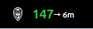

# NightWatcher - Nightscout CGM Monitor GNOME Extension


A GNOME Shell extension that seamlessly integrates with Nightscout to display real-time blood glucose levels in your system panel. Monitor your CGM (Continuous Glucose Monitor) data directly from your desktop with customizable alerts and visual indicators.



## ✨ Features

- **Real-time Monitoring**: Display current glucose levels directly in your GNOME top panel
- **Visual Indicators**: 
  - Trend arrows showing glucose rate of change
  - Delta values indicating glucose changes
  - Elapsed time since last reading
  - Customizable colors for different glucose ranges
- **Smart Alerts**: 
  - Configurable high/low glucose thresholds
  - Sound alerts for out-of-range values
  - Visual notifications
- **Customizable Display**:
  - Adjustable panel icon position
  - Toggle delta values, trend arrows, and time display
  - Quick access menu with detailed information

## 🚀 Installation

### From GNOME Extensions Website
1. Visit [GNOME Extensions](https://extensions.gnome.org) and search for "Nightscout Indicator"
2. Click "Install" to add the extension
3. Enable the extension using the toggle switch

### Manual Installation
```bash
# Clone the repository
git clone https://github.com/faymaz/nightwatcher

# Copy to GNOME extensions directory
cp -r nightwatcher ~/.local/share/gnome-shell/extensions/nightwatcher@faymaz.github.com

# Enable the extension
gnome-extensions enable nightwatcher@faymaz.github.com
```

For Wayland sessions, log out and log back in after installation.

## ⚙️ Configuration

Access settings through GNOME Extensions app:

### Account Settings
- Nightscout site URL
- API token

### Threshold Settings (mg/dL)
- Urgent High: 240
- High: 180
- Low: 95
- Urgent Low: 80

### Display Options
- Delta values
- Trend arrows
- Time display
- Icon position

## 📋 Requirements

- GNOME Shell 45 or newer
- Active Nightscout site
- Valid Nightscout API token

## 🛠️ Development

Built using:
- GJS (GNOME JavaScript)
- GTK4 and Libadwaita
- GNOME Shell APIs

### Contributing

1. Fork the repository
2. Create a feature branch
3. Make your changes
4. Submit a Pull Request

## 📝 License

This project is licensed under the GPL-3.0 License - see [LICENSE](LICENSE) for details.

## 💬 Support

- [Report Issues](https://github.com/faymaz/nightwatcher/issues)
- [Nightscout Documentation](http://nightscout.github.io/)

## Credits

- Inspired by the Nightscout community